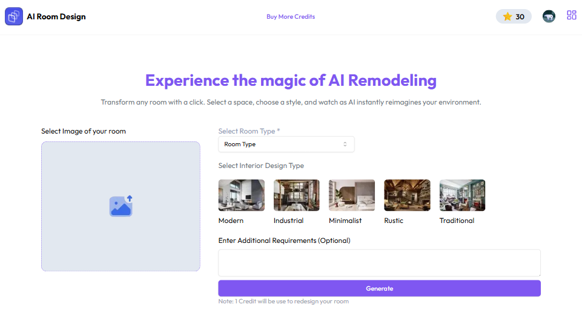

# AI-REDESIGN-ROOM
This application enables users to redesign their room interiors by uploading an image, selecting a room type, choosing a design style, and entering an optional prompt to generate a customized design image.

Techologies used: Nextjs15, Typescript, ShadcnUI, TailwindCSS, Firebase, PostgreSQL, Drizzle-ORM, Neon, Replicate-API.

App features:
- Save image uploaded in firebase-storage.
- Implemented Clerk-authentication.
- Used of replicate API.
- Integrated Paypal payment gateway.

# Application live link
https://interior-design-gen-ai.vercel.app
